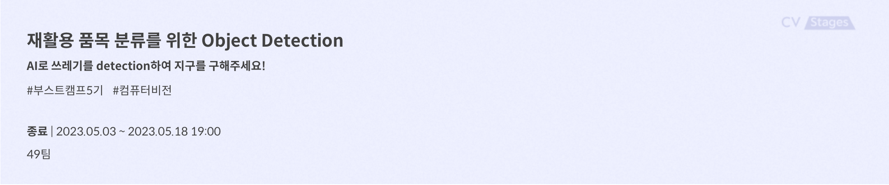

# level2_objectdetection-cv-19
<!-- ALL-CONTRIBUTORS-BADGE:START - Do not remove or modify this section -->
[](#contributors-)
<!-- ALL-CONTRIBUTORS-BADGE:END -->

- [부스트캠프 AI Tech](https://boostcamp.connect.or.kr/program_ai.html) - Level2. Object Detection Competition  

# Introduction


목표 : 주어진 사진에서 10종류의 재활용 쓰레기를 분류하여 탐지하는 모델 제작

데이터 셋 : 쓰레기 객체가 담긴 1024 x 1024 크기의 image train data 4883장, test data 4871장

프로젝트 개발 환경 : 
    Ubuntu 18.04.5 LTS
    , Intel(R) Xeon(R) Gold 5120 CPU @ 2.20GHz
    , Ram 90GB
    , Tesla V100 32GB

---
## Contributors
**`V.I.P`** **`==`** 
**`✨Visionary Innovative People✨`** 
<table>
  <tr>
    <td align="center"><a href="https://github.com/seoin0110"><br /><sub><b>김서인</b></sub></a><br /><a href="https://github.com/seoin0110" title="Code"></td>
    <td align="center"><a href="https://github.com/moons98"><br /><sub><b>문상인</b></sub></a><br /><a href="https://github.com/moons98" title="Code"></td>
    <td align="center"><a href="https://github.com/jaehun-park"><br /><sub><b>박재훈</b></sub></a><br /><a href="https://github.com/jaehun-park" title="Code"></td>
    <td align="center"><a href="https://github.com/adam1206"><br /><sub><b>이강민</b></sub></a><br /><a href="https://github.com/adam1206" title="Code"></td>
     <td align="center"><a href="https://github.com/Jeon-jisu"><br /><sub><b>전지수</b></sub></a><br /><a href="https://github.com/Jeon-jisu" title="Code"></td>
  </tr>
</table>

###  역할
|팀원|역할|
|-----|---|
|김서인|RabbitMQ 도입, data augmentation 구현 및 실험, 모델 성능 향상 실험 진행, earlystop setting|
|문상인| PM(Project Manager), MMDetection & YOLO 데이터셋 구축, 자동 학습 queue 구현 및 실험 진행 |
|박재훈| GPU 스케줄러 개발, MMDetection Baseline 구축, loss & optimizer 실험, 앙상블 코드 구현 및 실험|
|이강민|MMDetection 베이스라인 구축,  YOLO 모델 개발|
|전지수|데이터 EDA, Wandb setting, pseudo_labeling 진행, inference 결과 시각화 및 분석|


---

## Repository 구조
- Repository 는 다음과 같은 구조로 구성되어있습니다. 

```
├── images
├── codebook
├── detectron2
├── .gitignore
├── .gitmessage.txt
├── ISSUE_TEMPLATE.md
├── README.md
├── pull_request_template.md
└── requirements.txt
```
----
## requirements
- visdom==0.2.4
- seaborn==0.12.2
- albumentations==0.4.6
- imgaug==0.4.0
- pycocotools==2.0.6
- opencv-python==4.7.0.72
- tqdm==4.65.0
- torchnet==0.0.4
- pandas==1.1.5
- map-boxes==1.0.5
- jupyter==1.0.0


----
## 협업 툴 및 프로젝트 관리

### 1. GitHub
- GitFlow를 따라 Github를 활용했다. 개발 과정에서 다음과 같은 절차를 따라 진행했다.
  - 이슈 생성
  - Feature branch 생성
  - Pull Request
  - 코드 리뷰 및 merge
- commit message는 ‘feat: ~ ’ 형식을 사용하였고, issue와 관련된 commit인 경우 issue 번호를 commit message의 foot에 추가해주었다.

### 2. Notion

### 3. WandB
- MMDetWandbHook을 통해 실험 결과를 wandb 상에 validation mAP, train loss, train acc 등을 로깅하였다.

### 4. RabbitMQ 기반 GPU 스케줄러 구현
- 팀에서 총 5대의 GPU 서버를 운용하고 있는 상황에서, 전체 GPU 리소스의 평균 가동률을 극대화하고 실험 속도를 높이기 위해서 GPU 스케줄러에 대한 요구가 생겼다. 따라서 메세지 큐인 RabbitMQ를 이용해 GPU 스케줄러를 구현하였으며, 본 프로젝트에서는 부분적으로 테스트해보며 사용성과 버그를 찾아 보완하였다. 구조는 아래 그림과 같다.

  

----
## 프로젝트 결과
**`최종 순위 13등`**<br><br>


  |분류|내용|
  |-----|---|
  |Dataset|**EDA** <br>- 일반 쓰레기를 잡기 어려움<br>- 쓰레기봉투 안에 쓰레기들의 존재<br><br>  **Dataset 구성**<br>- 이미지 당 30, 35, 40개 이상의 박스를 가지는 이미지를 제거한 데이터 셋 align 실험|
  |MMDetection| **여러 구조에 대한 benchmarking 학습을 진행**<br>- 2 stage: Faster R-CNN, Cascade R-CNN, Mask R-CNN, Grid R-CNN<br>- 1 stage: RetinaNet, FreeAnchor, FCOS, Fovea, CornerNet, ATSS |
  |Data augmentation| **Albumentation 조합 선택**<br>- RandomSizedBBoxSafeCrop<br>- OneOf(VerticalFlip, HorizontalFlip)<br>- ToGray<br>- GaussNoise<br>- OneOf(Blur, GaussianBlur, MedianBlur, MotionBlur)<br>- CLAHE<br>- RandomBrightnessContrast<br>- HueSaturationValue|
  |Optimizer|- Stochastic Gradient Descent(SGD)와 AdamW의 비교|
  |Focal Loss| - Focal Loss와 Cross Entropy Loss와의 비교|
  |YOLOv8| - Input image size 업스케일링<br>- Localization loss function 변경<br>- Data augmentation 변경<br>- Model size 교체<br>- 추가 학습 진행<br>|
  |Ensemble|- TTA (Test Time Augmentation)<br>- NMS (Non-Maximum Suppression)<br>- WBF (Weighted Box Fusion) |
  |Pseudo-labeling|- 리더보드 기준 가장 좋았던 성능의 inference 결과에 포함되어 있는 bbox의 annotation 정보를 다시 train dataset으로 가져와서 학습 |